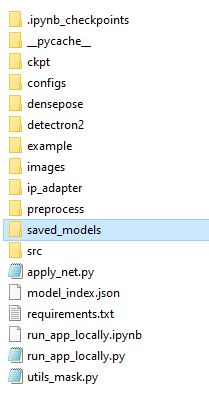

# IDM-VTON: Local Virtual Try-On

This repository provides a **Python script (`run_app_locally.py`)** to run the **IDM-VTON** virtual try-on model locally. The script takes a **human image** and a **garment image** to generate a virtual try-on result.

## 📌 Setup Instructions
Before using the Python script or Jupyter Notebook, you must first clone the repository:

```bash
git clone https://huggingface.co/spaces/yisol/IDM-VTON
```

Once cloned, ensure your folder structure matches the following:


The saved_models folder is created automatically on running the jupyter notebook or script for the first time

## **📌 Features**
- Run IDM-VTON **locally** using pre-trained models.
- Accepts **custom input images** via command-line arguments.
- Saves the generated try-on image to a **user-specified file**.
- Automatically **downloads the model** from Hugging Face if not available.

---

## **🔹 Requirements**
Before running the script, ensure you have installed the required dependencies:

```bash
pip install torch torchvision diffusers transformers huggingface_hub numpy pillow
```

---

## **📌 Usage**
To run the script, provide the paths to:
1. The **human image** (`--human_img`)
2. The **garment image** (`--garm_img`)
3. The **output file** where the generated try-on image will be saved (`--output_img`)

### **🔹 Command Example**
```bash
python run_app_locally.py --human_img "inputs/person.jpg" --garm_img "inputs/shirt.jpg" --output_img "outputs/tryon_result"
```
This will:
- Use **`inputs/person.jpg`** as the human image.
- Use **`inputs/shirt.jpg`** as the garment image.
- Save the output as **`outputs/tryon_result.png`** (automatically appends `.png`).

---

## **📌 Arguments**
| Argument      | Description                                    | Required |
|--------------|------------------------------------------------|----------|
| `--human_img`  | Path to the input **human image** file.      | ✅ Yes  |
| `--garm_img`   | Path to the input **garment image** file.    | ✅ Yes  |
| `--output_img` | Path + filename (without `.png`) to save the output. | ✅ Yes  |

---

## **📌 Output**
- The script generates a **virtual try-on image** and saves it to the specified output path with `.png` appended.
- Example output:
  ```
  Generated try-on image saved at: outputs/tryon_result.png
  ```

---

## **📌 Model Download**
The first time you run the script, it will **automatically download the IDM-VTON model** from Hugging Face and save it to:
```
saved_models/IDM-VTON
```
This avoids repeated downloads for future runs.

---

## **📌 Notes**
- The script requires **a GPU (CUDA)** for best performance. If no GPU is available, it will run on **CPU**, but much slower.
- Ensure input images are **high resolution** for the best results.

---

## **📌 License**
This project is open-source and available for research and non-commercial use.

---
